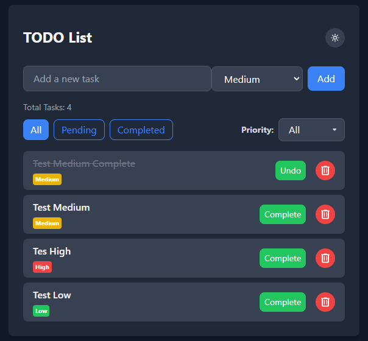

# TODO List

A simple and interactive TODO List application built with **Vue 3**, **Vite**, and **Tailwind CSS**. It allows users to manage tasks efficiently with features like filtering, prioritization, dark mode, and data persistence using `LocalStorage`.

---

## Features

- **Task Management**: Add, complete, and delete tasks easily.
- **Filtering Options**: Filter tasks by status (All, Pending, Completed) and by priority (High, Medium, Low).
- **Dark Mode**: Switch between light and dark themes for better user experience.
- **Data Persistence**: Tasks and filters are saved in the browser using `LocalStorage`.
- **Animations**: Smooth transitions when adding or removing tasks.
- **Responsive Design**: Fully functional on desktop and mobile devices.

---

## Preview

### Light Mode:

### Dark Mode:

---

## Technologies Used

- **Vue 3**: JavaScript framework for building the user interface.
- **Vite**: Fast development server and build tool.
- **Tailwind CSS**: Utility-first CSS framework for styling.
- **LocalStorage**: Browser storage for task and filter persistence.

---

## Usage

1. Add tasks by typing in the input field and clicking "Add".
2. Filter tasks using the **status filters** (All, Pending, Completed) and **priority dropdown**.
3. Toggle dark mode using the button in the top-right corner.
4. Tasks and filters are automatically saved in `LocalStorage`.

---

## Future Enhancements

- Add task deadlines and reminders.
- Sync tasks across devices using a backend service.
- Allow task categorization or grouping.
- Add drag-and-drop functionality for task ordering.